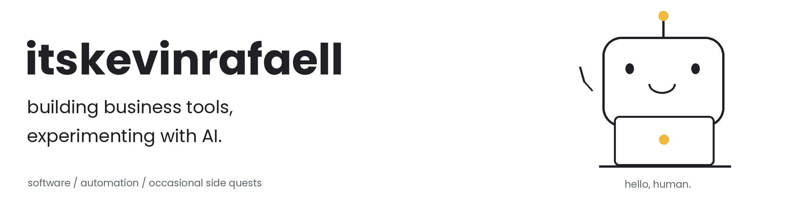

<picture>
  <source media="(prefers-color-scheme: dark)" srcset="assets/fun-dark.png" />
  
</picture>

[website](https://temanumkmkita.com) · [repositories](https://github.com/itskevinrafaell?tab=repositories)

I build software for procurement, agency operations, and content production. Some projects live in private repositories; here's what I'm working on.

### The business stuff

| Project | What it does | Source |
| :--- | :--- | :--- |
| **[TemanPengadaan](https://github.com/itskevinrafaell/temanpengadaan-showcase)** | Project requirements, product sourcing, quotation comparison, and recorded procurement decisions. | Private |
| **[Kantor Teman](https://github.com/itskevinrafaell/kantor-teman)** | Leads, proposals, project boards, and agency finance. | Public |
| **[Office Kantor Teman](https://github.com/itskevinrafaell/office-kantor-teman-showcase)** | Social content and carousel production with AI-assisted workflows. | Private |
| **[Teman UMKM Kita](https://github.com/itskevinrafaell/temanumkmkita)** | Business website, publishing CMS, and CRM-connected contact forms. | Public |

### AI in my workflow

I use multiple AI tools for development, research, document review, and automation:

**Claude / Claude Code** · **Hermes Agent** · **model APIs**

That includes experimenting with different models, scheduled tasks, and multi-agent workflows. AI is part of how I work, not just a feature label on my projects.

### Tools on my desk

Side quests: research and reusable tools

- [BISINDO Bridge](https://github.com/itskevinrafaell/bisindo-bridge): static fingerspelling recognition research using PyTorch and MediaPipe. Prototype, with documented limitations.
- [Pika Starter Kit](https://github.com/itskevinrafaell/pika-starter-kit): a Laravel and Filament starting point with shared plugin configuration.

### A little snack for the contribution graph

<picture>
  <source media="(prefers-color-scheme: dark)" srcset="assets/contributions-dark.svg" />
  
</picture>
