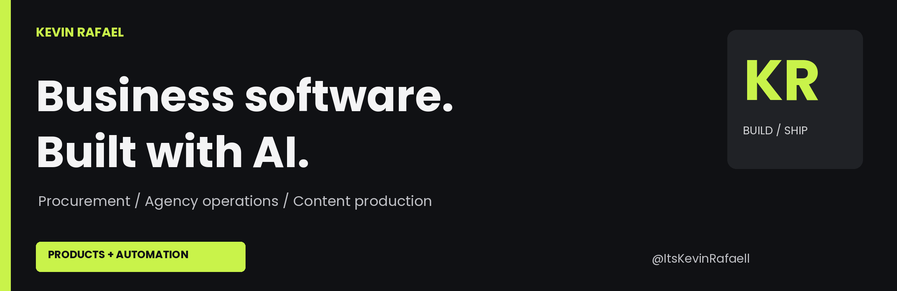
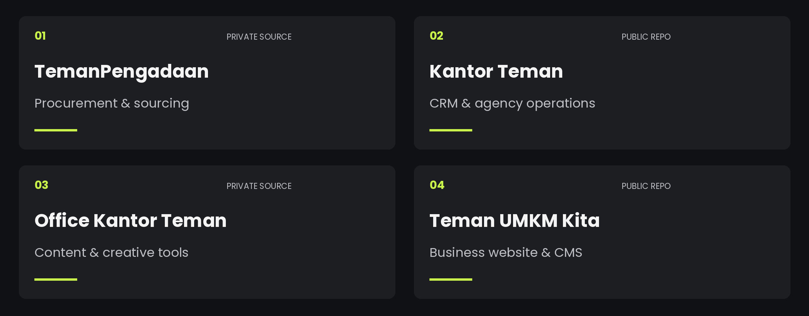

# Hi, I'm Kevin.

I build software for business operations: **procurement, agency management, and content production.** I work on the product and the code, with AI tools as part of my development, research, and automation workflow.

[Teman UMKM Kita](https://temanumkmkita.com) · [Public repositories](https://github.com/ItsKevinRafaell?tab=repositories)

## Business software I'm building

### 01 / TemanPengadaan &nbsp; PRIVATE SOURCE

A workspace for internal procurement decisions. Organize project requirements, source products, compare supplier quotations and marketplace references, and keep the reasoning behind a purchasing decision.

**Focus:** sourcing, quotation comparison, and traceable decisions.

---

### 02 / Kantor Teman &nbsp; PUBLIC REPOSITORY

Agency operations in one place: leads, proposals, project boards, and finance. The work starts before a deal closes and continues through delivery.

**Focus:** CRM and day-to-day agency operations.  
[Browse the repository](https://github.com/ItsKevinRafaell/kantor-teman)

---

### 03 / Office Kantor Teman &nbsp; PRIVATE SOURCE

A creative workspace for social content and carousel production, with AI-assisted content workflows.

**Focus:** content production and creative tools.

---

### 04 / Teman UMKM Kita &nbsp; PUBLIC REPOSITORY

A business website with a custom CMS for articles, services, and portfolio content, plus contact forms connected to the CRM.

**Focus:** the public-facing side of the business.  
[Visit the website](https://temanumkmkita.com) · [Browse the repository](https://github.com/ItsKevinRafaell/temanumkmkita)

> Some of my business projects have private source code. This profile describes their scope; the public repositories only show part of my work.

## AI is part of how I work

I use multiple AI tools for coding, research, document review, and workflow automation. I also experiment with different models and agent setups rather than using one tool for every task.

- **Claude / Claude Code** for document review and AI-assisted development.
- **Hermes Agent** for tool-based workflows, scheduled tasks, and multi-agent automation.
- **Model APIs** for integrating AI into applications and comparing models across tasks.

## Development stack

**Web & backend:** TypeScript, Next.js, Python, FastAPI, Go, PHP, Laravel.  
**Mobile:** Dart, Flutter.  
**Data & research:** MySQL, SQLite, PyTorch, MediaPipe.

Other work: research and developer tooling

- [BISINDO Bridge](https://github.com/ItsKevinRafaell/bisindo-bridge): a research prototype for static fingerspelling recognition, with training code and documented limitations.
- [Pika Starter Kit](https://github.com/ItsKevinRafaell/pika-starter-kit): Laravel and Filament tooling with centralized plugin configuration.

