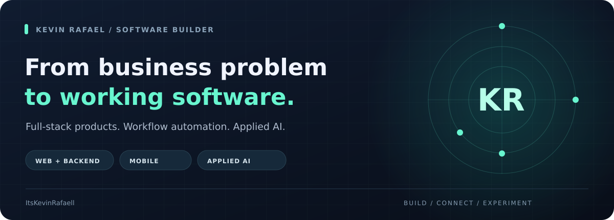
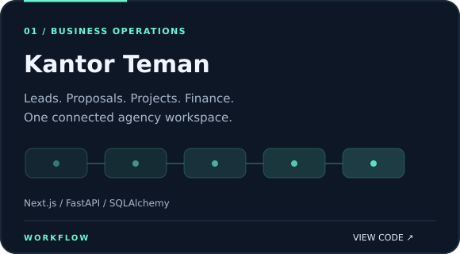
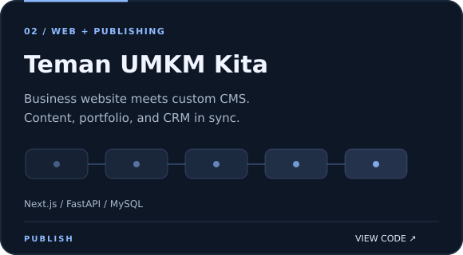
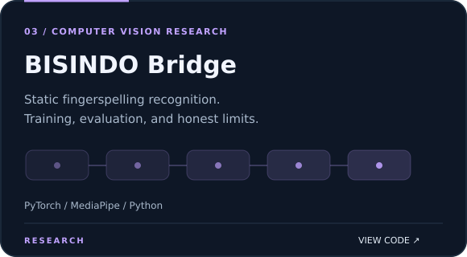
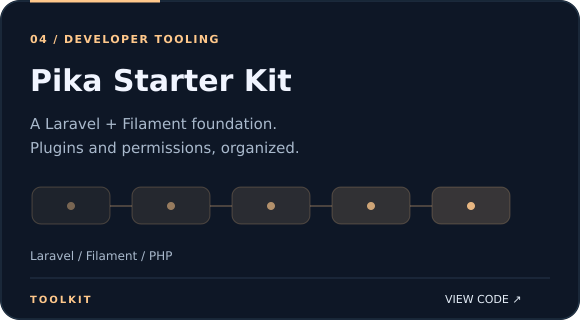

  
  

## Building beyond the interface

I'm Kevin. I build **business software that connects the whole workflow**: the interface people use, the API behind it, and the data that keeps it running. My projects also cover mobile development and computer vision research.

**Main focus:** agency operations, publishing systems, and automation.

 

## Featured builds

 

### What to look at

- **Kantor Teman:** the connected workflow, from lead capture to project delivery and finance.
- **BISINDO Bridge:** reproducible training code, evaluation reports, and [documented limitations](https://github.com/ItsKevinRafaell/bisindo-bridge/blob/main/docs/LIMITATIONS.md). A research prototype, not a production sign-language translator.
- **Pika Starter Kit:** shared plugin configuration instead of repeated panel setup.

 

## My toolkit

 

**Web & backend** &nbsp; TypeScript · Next.js · FastAPI · Go · Laravel  
**Mobile** &nbsp; Dart · Flutter  
**Data & research** &nbsp; MySQL · SQLite · PyTorch · MediaPipe

---

<b>Explore the code. See how the pieces fit.</b> <a href="https://temanumkmkita.com">temanumkmkita.com</a> · <a href="https://github.com/ItsKevinRafaell?tab=repositories">All repositories</a>

